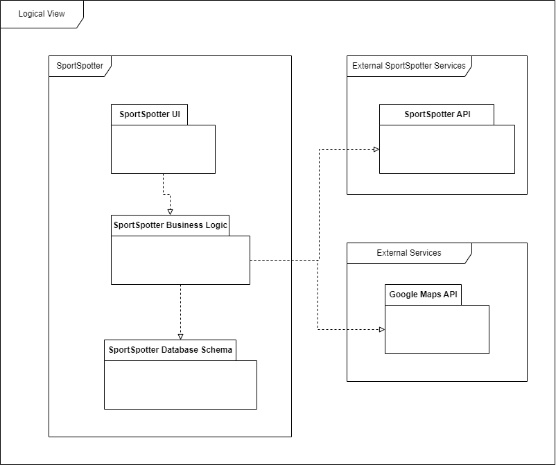

## Architecture and Design

### Logical architecture
portSpotter: This package represents the top-level package for the application on the smartphone. It contains the other logical packages that make up the system.

SportSpotter UI: This package contains the frontend logic for the application, including user interface components.

SportSpotter Business Logic: This package contains the user-side business logic, and API calls to the backend.

SportSpotter Database Schema: This package contains the local database logic and API.

External SportSpotter Services: This package represents the top-level package for the external services to the smartphone. It contains the other SportSpotter services that make up the system.

SportSpotter Database API: This package contains the backend logic for the application, including database access and business rules.

External Services: This package represents the top-level package for external services application depends on. It contains other logical packages that make up the system.

Google Maps API: This package contains the Google Maps API.

### Physical architecture
Mobile Device: This is the top-level node that represents the application system in a smartphone.

App: This artifact represents the application software using flutter framework software that is installed on the client devices and used to build and run the system's mobile application.

Locale Storage: This artifact represents the local database on the client devices. It includes the SQLite software that is installed on the client devices.

Software Application Server: This is the top-level node that represents the application backend system, installed in a server.

Account, Facilities, Account Services and Search Services: These artifacts represent all the dart files that contains the backend logic for the application.

Application Database: This artifact represents the database associated with the server. It uses NoSQL and is implemented using Firebase.

Google Server: This node represents the Google's server.

Google Maps: This artifact represents the Google Maps system and database.

### Vertical prototype
To help on validating all the architectural, design and technological decisions made, we usually implement a vertical prototype, a thin vertical slice of the system.

In this subsection please describe which feature you have implemented, and how, together with a snapshot of the user interface, if applicable.

At this phase, instead of a complete user story, you can simply implement a feature that demonstrates thay you can use the technology, for example, show a screen with the app credits (name and authors).
