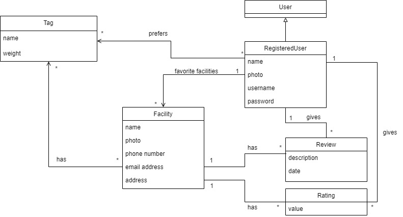

## Requirements

In this section, you should describe all kinds of requirements for your module: functional and non-functional requirements.

### Domain model
- The User class represents any user of the application. It has no attributes because it can only search facilities or register to create an account.
- The Registered User class represents a specific type of user who has registered an account. It has attributes for user's name, photo, account's username, password, a list of tags and a list of facilities associated with the account. This class is used to store and retrieve user information and preferences, such as a list of favorite facilities and a list of tags, as well as to perform interactions with the business.
- The Facility class represents a sport facility in the business. It has attributes for the facilities' name, photo, phone number, email address, address, a list of tags, a list of reviews and a list of ratings given to this facility. This class is used to store and retrieve facility information as well as to perform operations related with facilities.
- The Tag class represents any type of standard search option. It has attributes for the name and weight of such a tag. This class is used to store and retrieve any kind of relevant and standard information a facility can have.
- The Review class represents a review made by a registered user. It has attributes for the description, date, user and facility associated with the review. This class is used to store and retrieve information related to each review.
- The Rating class represents a rating given by a registered user. It has attributes for value given by the user, user and facility associated with the rating. This class is used to store and retrieve information related to each rating.

